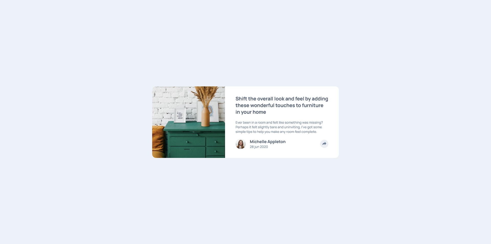

# Frontend Mentor - Article preview component solution

This is a solution to the [Article preview component challenge on Frontend Mentor](https://www.frontendmentor.io/challenges/article-preview-component-dYBN_pYFT). Frontend Mentor challenges help you improve your coding skills by building realistic projects. 

## Table of contents

- [Overview](#overview)
  - [The challenge](#the-challenge)
  - [Screenshot](#screenshot)
  - [Links](#links)
- [My process](#my-process)
  - [Built with](#built-with)
  - [What I learned](#what-i-learned)
- [Author](#author)

## Overview

### The challenge

Users should be able to:

- View the optimal layout for the component depending on their device's screen size
- See the social media share links when they click the share icon

### Screenshot

### Links

- Solution URL: [https://github.com/bugvlopper/FrontendMentor-articles-preview.git](https://github.com/bugvlopper/FrontendMentor-articles-preview.git)
- Live Site URL: [https://bugvlopper.github.io/FrontendMentor-articles-preview](https://bugvlopper.github.io/FrontendMentor-articles-preview)

## My process

### Built with

- JSX
- CSS 
- Flexbox
- Mobile workflow
- [React](https://reactjs.org/) - JS library

### What I learned

I learn how to use CSS position , especially how to use the position: absolute; with relative parent (huge improvement for me)

## Author

- Frontend Mentor - [@bugvlopper](https://www.frontendmentor.io/profile/bugvlopper)
